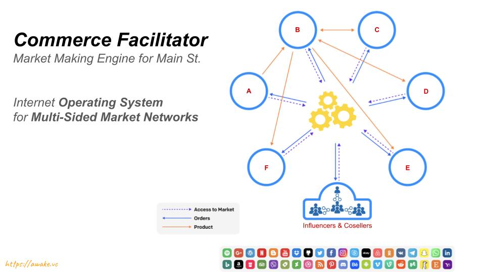

# ComFac

Just as Stripe (or PayPal) is a Payment Facilitator, a ComFac is a **Commerce Facilitator**. 

## Commerce Facilitator

What does a ComFac do exactly?

### Business Connections

The first empowerment comes from being able to connect with everyone. A ComFac is an interconnected network platform for any business or industry. As a ComFac platform for B2B2C networks, it allows members to find each other and learn about each other and to eventually do business together. In this sense, a ComFac enables *business connections*. 

### Business Transactions

A ComFac also enables transactions, which means it allows seamless payments in any currency, as needed by members of the network. This functionality makes a ComFac a *FinTech* platform that enables native commerce.

### Business Market

Speaking of native commerce, all these transactions happen within a market and a ComFac platform creates a natural native market within the community of members. This native market is a seamlessly integrated aspect of membership, and is what qualifies the business network to be a market network, connecting not just market participants, but other markets into an interconnected marketplace.

### Business Referrals

A ComFac not just connects entities to each other, and enables transactions between them, but also enables tracking referrals that lead to those transactions. It can even automatically pay out commissions based on profit generated by the market transactions.

### Trust

A ComFac network acts as a a provider (or mechanism) of trust between the participants of the network, and effectively enables commerce, empowering the native economy present within any community or industry. Trust in the market is of critical importance if it were to be a liquid market.

### Loyalty

A ComFac engine also enables loyalty amongst the beneficiaries of the market economy, and can offer cash backs and discounts and other benefits to being a member of the market economy.

### Taxes

A ComFac engine can automatically collects appropriate taxes from the various parties based on their location and the applicable jurisdiction.

### KYC / AML

A ComFac engine can automatically enforce Know-Your-Customer and Anti-Money-Laundering rules, enabling compliance for all participants. This applies to all regulations, not just KYC.

---

[*AwakeVC*](https://awake.vc) **|** San Mateo, CA **|** *+1 415 800 4888* **|** [*info@awake.vc*](mailto:info@awake.vc)

*Because Protocols Are Eating Venture*