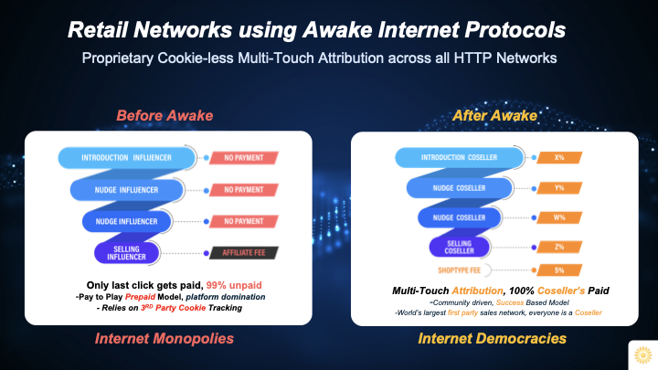

# Cosellers

When the world has been modeled as a set of [Protocols](Protocols%202d8283d30f25457e8452c1911667dcb0.md)  within a network-of-networks ([Network](Network%2056ec2f6cf28c4c99991d8041844df0df.md)) it is easy to create new business models that arise from being able to deal with a single network as opposed to a set of fragmented Internet platforms. 

This single meta network ([MetaWeb](MetaWeb%202e4dacd7566d45b78d97612a186082c0.md)) makes it possible to track complete data about all relevant business activities, regardless of which platform it takes place on.

### Internet 3.0

We have discussed Web3 and related ideas, and of the many Layer 8 applications made possible by the MetaWeb Protocol, ***retail*** is amongst the most obvious. 

With [SaleRank](SaleRank%202c870469ef3e446c865f162190c4c0f9.md) it is possible to know exactly how a sale happened on the Internet. The level of granularity is important because with multi-touch attribution one would know exactly who the individuals were who helped drive any particular sale across the social media universe.

### Creators

In particular this has an impact on the lives of creators and influencers, the unsung heroes of the Internet. Anyone that creates [HTTP](HTTP%20aa82b4ce356349bf81da2e73d2aa8482.md) content on the Internet should benefit if that content drove a sale or made profit for someone else or for another platform.

With Awake Internet Protocols, this is a fundamental property of the very fabric of retail, that all participants engaged in driving a sale across multiple touch-points get compensated in a model that can only be described as *actual social commerce*.

### Influencers

And for influencers that already are trying to monetize their presence and content on the Internet, particular across the likes of TikTok and Instagram, the prospect of being able to natively monetize any digital content they create across all of social media using DTC and e-commerce is an enticing one.

Suddenly, influencer-led commerce becomes influencer-led brands, and influencers can recruit huge armies of followers to not just buy their products and services, but can also recruit followers to drive sales on their behalf. A regenerative economy can be stimulated to take hold.

### Affiliates

And for affiliates, having multi-touch attribution is a dream come true.

Think about it. Without Awake, an affiliate is just that: a retail salesperson who gets paid on each successful sale. On the Internet, typical conversion rates are less then 1%. This means that for every 100 clicks that an affiliate drives, less than one is likely to convert into a sale. Assuming cookies are set right (allowed even) the affiliate will get their fees eventually, usually 5% to 15%, most commonly in the single digit range. 

.jpg)

Retail 3.0 is a natural outcome of Internet 3.0

## Web 123

The first two phases of the Internet - web1 and web2 - both represented the same old business models from the previous eras. A network aggregated supply on one side to give buyers a large selection and through volume negotiations would also offer them low prices. Walmart is a classic example of the *old old world*, although it is more like *new old world* given all its recent investments in digital transformation.

Amazon is also the same basic business model, as are Apple, Facebook, Google, and all the other large Internet networks who leverage their aggregated audiences to arbitrage the attention economy or the commodity-economy.

Web3 promises democracy, but has a lot of complexity and other issues including energy consumption, as well as it does not solve for interoperability and backwards compatibility with web2 and traditional businesses.

## Cosellers

Awake Internet Protocols enable exactly this desired world where modern decentralized market networks powered with HTTP are able to work with everyone on the Internet with 1-click simplicity.

With Awake, there is the ultimate democratization because no network is superior to any other network, and human beings directly work with each other in a peer-to-peer manner, mediated by social market networks that share data and profits with members in transparent ways.

With this democratization also comes another side effect: the return of monetization to the creator economy and to the influencer class. A whole new type of Internet job emerges, we call this the Coseller. 

### #NoSelling

There are some key differences between affiliate marketers and cosellers:

Margins

Typical coseller opportunity is 20% to 40% and even higher for a large number of categories of products and services across Awake Market Networks.

Cookies

Coseller networks do not rely on cookies, instead they use wallets to deposit funds into user accounts based on any content they create or share. 

These wallets are similar to crypto wallets but do not require complex Web3 integration to access via blockchain, instead they use simple HTTP protocols to drive authentication and authorization.

The world's largest salesforce, this is the title that Awake lays claim on, not today but soon as everyone on the Internet signs up for their free Coseller Wallet and makes money through trusted networks and natural word of mouth. 

Certainly Awake already is the world's largest first-party community-powered salesforce!

Last-Click

The most important difference between affiliates and cosellers is that traditional affiliate networks not just rely on 3rd-party cookies to track purchases, but also only make payouts to those who actually close the sale. Affiliates are retail sales associates.

If an affiliate does not close a sale immediately upon click but instead pushes the potential customer along their buyer journey to purchase another day, they get paid nothing for their efforts.  This is because thanks to active data hiding by some [HTTP](HTTP%20aa82b4ce356349bf81da2e73d2aa8482.md) networks particularly the large platform companies, there is no way for businesses to know who their cosellers really are. 

Businesses are forced to play the prepaid ad game with these platform companies because these platforms claim all the attribution on behalf their users. Pay them for clicks, and hope for 1% conversions, that’s the only game in town, and if you’re a startup or don’t have a lot of capital to pour into their coffers, you’re fresh out of luck on the Internet.

### Selling More Through #*NoSelling*

With Awake, one is no longer blind on the Internet, and thanks to the [MetaWeb](MetaWeb%202e4dacd7566d45b78d97612a186082c0.md) Protocol, a business can directly reward users om various social platforms across the Internet, in exchange for them driving sales for the brand.

Businesses can keep marketing the old fashioned way, or can reduce that ad spend in favor of actual social commerce powered by transparent cosellers networks, and no longer have to rely on poor tracking and broken cookies.

Cosellers no longer have to hope their click is the 1% where someone makes a purchase, instead they get rewarded for any click that leads up to a sale, they are able to split commissions, turning sales from a solo activity for hunters into team sports for communities.

Cosellers no longer have to even use the word "buy" anywhere, or promote any product at all. Instead they would engage online audiences using their comedy, their expertise, their influence, and would share Awake [HTTP](HTTP%20aa82b4ce356349bf81da2e73d2aa8482.md) links that would pay them out any time at all in the future their media was involved in any sale, depending on the rules of the network where the checkout occurred.

### The Internet is Awake

For a whole lot of Internet users, this will be the real awakening, where suddenly the global village becomes a reality, and every individual on the planet connects into this new Internet 3.0 economy where knowledge sharing and  helping others through action drives profit for their community and for themselves.

#NoSelling

---

[*AwakeVC*](https://awake.vc) **|** San Mateo, CA **|** *+1 415 800 4888* **|** [*info@awake.vc*](mailto:info@awake.vc)

*Because Protocols Are Eating Venture*