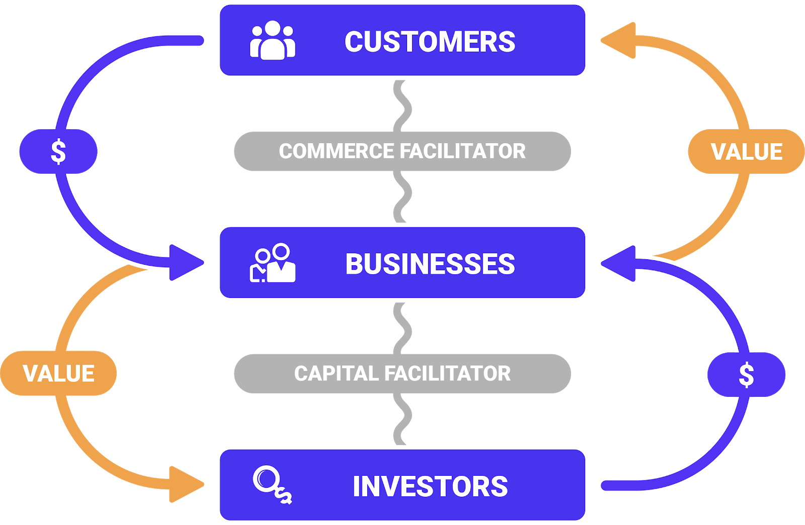
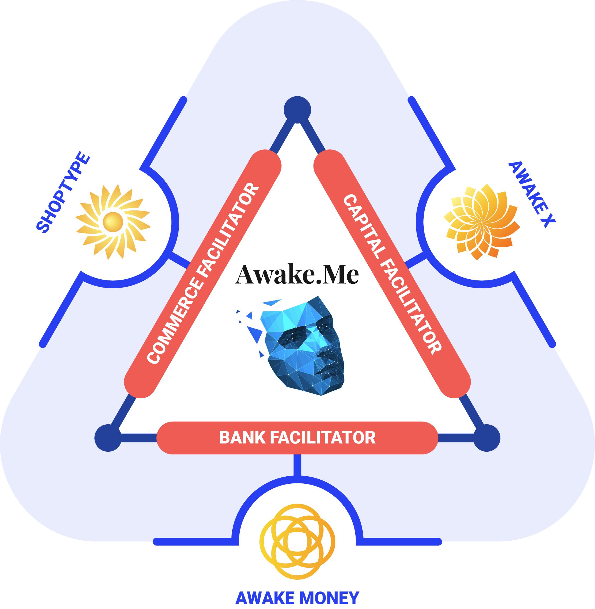

# Ecosystems

As we’ve seen so far, to create an ecosystem is to design and build an interconnected network of enterprises that perform complementary functions which are provided to each other as well as to external customers. 

The Awake stack comprises of the following layers:

        [  **Internet Brands**                               ]

        [  **Awake Networks**                             ]

        [  **Awake Cosellers**                             ]

        [  **Awake Protocols**                             ]

        [  **Blockchain Networks** - *****optional*  ****]

        [  **The Intergraph**                                ]

        [  **HTTP**                                                  ]

        [  **ISP**                                                       ]

**The Web2.5 Ladder: Empowering** ***Web3 for Corporates**.*

## A Tale of Facilitators

While the BankFac acts as a universal programmatic treasury, essentially a *central bank for the Internet*, the ComFac and CapFac interconnect via the natural process of Value Creation.

Together these three components form the Awake Value Co-creation Engine that empowers the new digital economy we call Internet 3.0.

## The Ecosystem is Awake

Awake uses a set of FinTech / AI platforms that reconfigures digital media and commerce across the Internet. Awake has created a Universal Meta Network for interconnected B2B2C Markets, allowing anyone to plug in and co-create value for themselves and respective communities, in any category of business.

### Core Business Protocols

The essence of any business is the customer, or the prosumer in the case of the new Internet 3.0.  

Prosumers and cosellers interact and trade with each other on the [Market](Market%2017a6dcf1e47c4942997542a2f5d27659.md). Profits and investments form part of the loop around the core business, as a regenerative loop sets up a virtuous cycle that benefits the whole ecosystem.

The business opportunity around ecosystems, or integrated market networks, is huge. McKinsey recently wrote about the massive $70 Trillion Dollar category they’re calling the [integrated network economy](https://www.mckinsey.com/business-functions/mckinsey-design/our-insights/a-design-led-approach-to-embracing-an-ecosystem-strategy).

[A design-led approach to embracing an ecosystem strategy](https://www.mckinsey.com/business-functions/mckinsey-design/our-insights/a-design-led-approach-to-embracing-an-ecosystem-strategy#)

Major categories where integrated networks make most sense and are the furthest along are shown in the picture below, also taken from the article above. 

[Competing in a world of sectors without borders](https://www.mckinsey.com/business-functions/mckinsey-analytics/our-insights/competing-in-a-world-of-sectors-without-borders)

Building and launching market networks in these categories is an immediate business opportunity and are candidates for Awake Internet Protocols.

## Awake Interconnected Protocols

This suite of Commerce Facilitator protocols work together to drive value for all participants of the market networks they empower. Anyone can connect into the business network ecosystem and through the FinTech layer get their share of profits deposited automatically as sales happen.

 

The future is already here, and in this future, you either become a platform or you will become *platformized*. The time to think in terms of cooperative networks and to build ecosystems is now. 

---

[*AwakeVC*](https://awake.vc) **|** San Mateo, CA **|** *+1 415 800 4888* **|** [*info@awake.vc*](mailto:info@awake.vc)

*Because Protocols Are Eating Venture*