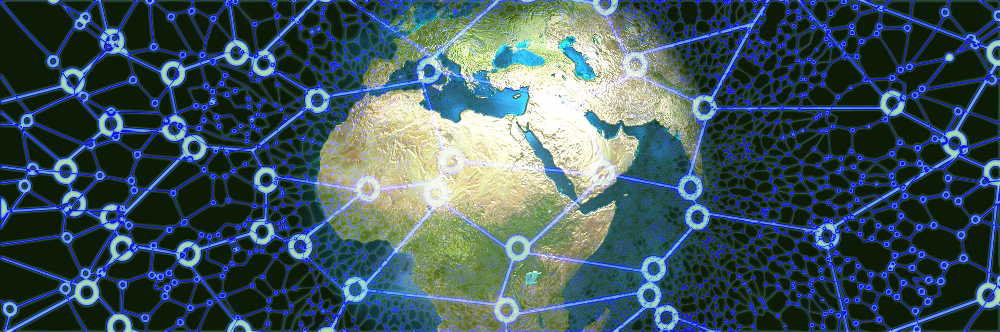

# Energy

We have attempted to answer the question of what[Value](Value%20cc65ad7be35d4223b93bb97c5809d923.md) is. In this section, we explore an interesting aspect of value, and what it might mean in practical terms.

## Physics and Economics

Just like energy, value comes in two flavors: potential value and kinetic value.

Just like energy, value can neither be created nor destroyed.

Just like energy, value can be transformed from one form to another.

Just like energy, value can be stored and transported.

Just like energy, value decays over time.

### Potential Value

As we already saw, value can be created any time an exchange occurs. Where does this new value come from, how does it get created?

In actual fact, value can not be created, it is just transformed from one form to another. Potential value is where an exchange may happen but does not because not all necessary conditions have been met, which include things like ease of doing the exchange.

Potential Value, which is what is everywhere, can be converted into something actual when the exchange is actuated by the two (or more) parties involved in the activity. 

### Kinetic Value

Just as potential energy at rest is kinetic energy in motion, so too is potential value converted into kinetic value, which is actual, and takes concrete form. The result of this may be some type of service or product is acquired by the purchaser, or a promise for future value such as a ticket or even an investment.

### Stored Value

And for the seller, excess value that was created is called profit. This is stored in the form of [Money](Money%2075918b0755a24a108c3a51ab94dd8450.md) and handled with the help of a [BankFac](BankFac%2032ac4e49861e4284983b3cd22384be39.md). 

Currency is a form of stored value when perceived as the buying power it represents, as is gold which can be sold to obtain currency whenever needed. Other forms of stored value include loaning money as an investment, which creates a liability for the borrower, but an asset for the lender. This type of stored value may also generate more value through interest payments and other means.

### Implications

What does this mean from a practical perspective? It means that anyone can create (transform) value from potential to kinetic, it only takes the work of creating the right conditions for the value exchange to happen.

The fact that value can neither be created or destroyed means it is not something special, all the value that can ever be created is already out there in potential form. It only needs to be unlocked, and anyone can unlock value, they only need to know what it *is*.

It also makes clear that anyone who makes it easier to facilitate a value exchange can help many others and thus co-create a lot of value for all sides. 

This means that ultimately there is nothing called monopoly because value creation is an infinite opportunity of transformation. It means that even when technology shifts and paradigm shifts happen, such as the industrial revolution or the AI revolution, there will always be new opportunities to transform value, from whatever new exists to something more experiential and personal and unique. 

It implies there is only abundance.

---

[*AwakeVC*](https://awake.vc) **|** San Mateo, CA **|** *+1 415 800 4888* **|** [*info@awake.vc*](mailto:info@awake.vc)

*Because Protocols Are Eating Venture*