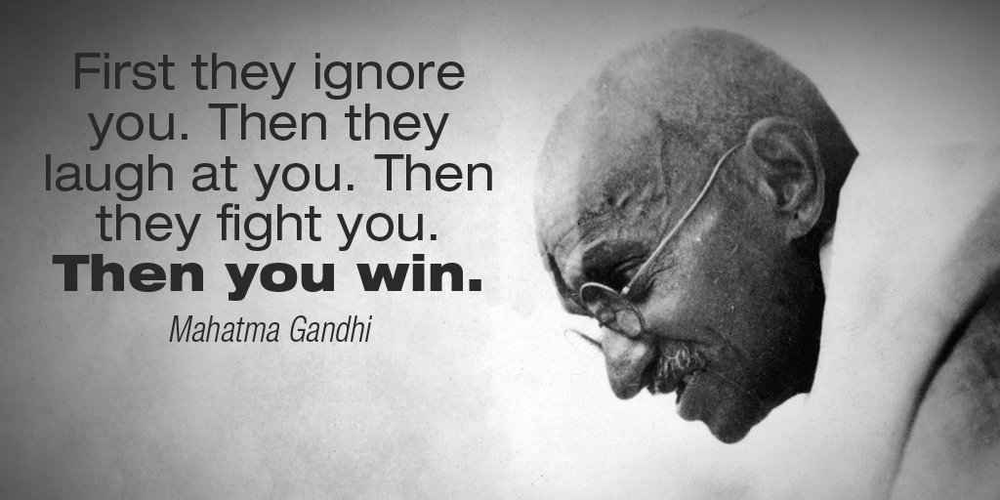

# Inspiration

A great many things brought on the Awakening. A few in no particular order:

[https://www.youtube.com/watch?v=smEqnnklfYs](https://www.youtube.com/watch?v=smEqnnklfYs)

[The Computer Revolution Hasn't Happened Yet by Alan Kay](https://catonmat.net/videos/the-computer-revolution-hasnt-happened-yet)

[Beating the Averages](http://www.paulgraham.com/avg.html)

[Hackers: Heroes of the Computer Revolution - Wikipedia](https://en.wikipedia.org/wiki/Hackers:_Heroes_of_the_Computer_Revolution)

[https://www.youtube.com/watch?v=cpzvwkR1RYU](https://www.youtube.com/watch?v=cpzvwkR1RYU)

[https://www.youtube.com/watch?v=VtvjbmoDx-I](https://www.youtube.com/watch?v=VtvjbmoDx-I)

[Maverick: The Success Story Behind the World's Most Unusual Workplace](https://www.amazon.com/Maverick-Success-Behind-Unusual-Workplace/dp/0446670553)

[The Cluetrain Manifesto: 10th Anniversary Edition](https://www.amazon.com/Cluetrain-Manifesto-10th-Anniversary/dp/B00846YFOO)

[The Cathedral & the Bazaar: Musings on Linux and Open Source by an Accidental Revolutionary](https://www.amazon.com/Cathedral-Bazaar-Musings-Accidental-Revolutionary/dp/0596001088)

[Linus Torvalds - Wikipedia](https://en.wikipedia.org/wiki/Linus_Torvalds)

[The Hacker Ethic and the Spirit of the New Economy: A Radical Approach to the Philosophy of Business](https://www.amazon.com/Hacker-Ethic-Spirit-New-Economy/dp/B00005AVX6)

[Masters of Doom - Wikipedia](https://en.wikipedia.org/wiki/Masters_of_Doom)

[The Goal: A Process of Ongoing Improvement - 30th Anniversary Edition](https://www.amazon.com/Goal-Process-Ongoing-Improvement/dp/0884271951)

[Start with Why: How Great Leaders Inspire Everyone to Take Action](https://www.amazon.com/Start-Why-Leaders-Inspire-Everyone/dp/1591846447/)

[Philosopher king - Wikipedia](https://en.wikipedia.org/wiki/Philosopher_king)

[Luke Skywalker - Wikipedia](https://en.wikipedia.org/wiki/Luke_Skywalker)

[For Us, the Living - Wikipedia](https://en.wikipedia.org/wiki/For_Us,_the_Living)

[https://youtu.be/Ki_Af_o9Q9s](https://youtu.be/Ki_Af_o9Q9s)

[Paul Graham (programmer) - Wikipedia](https://en.wikipedia.org/wiki/Paul_Graham_(programmer))

[Marc Andreessen - Wikipedia](https://en.wikipedia.org/wiki/Marc_Andreessen)

[Leonardo da Vinci - Wikipedia](https://en.wikipedia.org/wiki/Leonardo_da_Vinci)

[Steve Jobs - Wikipedia](https://en.wikipedia.org/wiki/Steve_Jobs)

[Elon Musk - Wikipedia](https://en.wikipedia.org/wiki/Elon_Musk)

[Arjuna - Wikipedia](https://en.wikipedia.org/wiki/Arjuna)

[Vedas - Wikipedia](https://en.wikipedia.org/wiki/Vedas)

[Warren Buffett - Wikipedia](https://en.wikipedia.org/wiki/Warren_Buffett)

[Peter Lynch - Wikipedia](https://en.wikipedia.org/wiki/Peter_Lynch)

[Pablo Picasso - Wikipedia](https://en.wikipedia.org/wiki/Pablo_Picasso)

[M. C. Escher - Wikipedia](https://en.wikipedia.org/wiki/M._C._Escher)

[Salvador Dalí - Wikipedia](https://en.wikipedia.org/wiki/Salvador_Dal%C3%AD)

[Structure and Interpretation of Computer Programs - Wikipedia](https://en.wikipedia.org/wiki/Structure_and_Interpretation_of_Computer_Programs)

[The New New Thing - Wikipedia](https://en.wikipedia.org/wiki/The_New_New_Thing)

[PARC (company) - Wikipedia](https://en.wikipedia.org/wiki/PARC_(company))

[Advaita Vedanta - Wikipedia](https://en.wikipedia.org/wiki/Advaita_Vedanta)

[Welcome to Your Own Self](https://irealization.com/)

---

[*AwakeVC*](https://awake.vc) **|** San Mateo, CA **|** *+1 415 800 4888* **|** [*info@awake.vc*](mailto:info@awake.vc)

*Because Protocols Are Eating Venture*