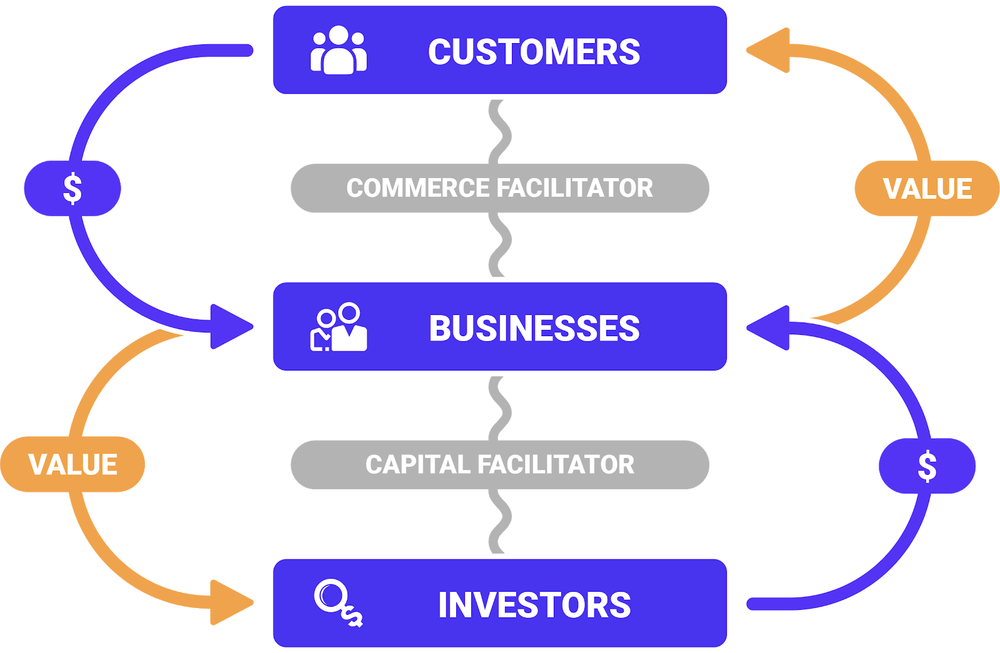

# Venture

Awake looks at the universe ([Network](Network%2056ec2f6cf28c4c99991d8041844df0df.md) ) through the lens of services. "What can I do for you?" or "May I do you a service?" or perhaps just "Service?".  Think of it like the proactive version of *Can I get some service around here?* 

So we already know how to be of [value](Value%20cc65ad7be35d4223b93bb97c5809d923.md) to [others](Identity%204409a634822e4ede94d74ccda524a84c.md), and the venture [business](Business%208f8d6fd9775049b8a0410c28bc094f18.md) is the same, just at scale. If the value being produced has an excess [amount](Money%2075918b0755a24a108c3a51ab94dd8450.md) in it, then we have a regenerative system, and the venture can think about scaling and finding new ways of creating more value.

# [Venture Protocol](https://VentureProtocol.com)

As we discussed, a successful venture hopes to find the perpetual motion machine of regenerative value creation. And because we know this, it is a process that can be identified, repeated, and improved, because the fundamentals do not change in any business.

### Value Creation

Awake Protocols enable complete digital transformation of business processes via a set of Facilitators: [ComFac](ComFac%2094b88322aa20499694a9ec4770828fd8.md), [BankFac](BankFac%2032ac4e49861e4284983b3cd22384be39.md), and [CapFac](CapFac%201f388e732e1c4988b71a939db3e0b1ff.md):

AwakeVC: A Tale of Value Facilitators

So building a venture is a simple process of playing Lego. Each component of the value co-creation is defined in the Venture Protocol, and actual implementation is available via specific platforms:

### Commerce Facilitator

As we discussed before, a [ComFac](ComFac%2094b88322aa20499694a9ec4770828fd8.md) is essentially a global B2BC network for Internet Commerce, and anyone can plugin to the BYOB party! That's Bring Your Own Business.   

### Bank Facilitator

And as we discussed before, as excess value is created and starts the regenerative engine, the value needs to be stored and transferred ([Money](Money%2075918b0755a24a108c3a51ab94dd8450.md)) between parties. 

### Capital Facilitator

Finally, we also discussed scaling businesses using growth capital ([CapFac](CapFac%201f388e732e1c4988b71a939db3e0b1ff.md)) which allows investors to come into the value co-creation game. With [Syndication](Syndication%20a356dc58f91542afac5ad21a56e20ddb.md), businesses can expand the source of capital to include their loyal community members across partners and customers.

### Venture Type

Businesses of the future need to be incubators for innovative ideas and for innovative people. 

Businesses will need to be ready to start new companies and launch joint ventures, license and resell products and services, set up partnerships and collaborations, all in the name of incremental cash flow, constant innovation. Businesses will need to stay on the right side of disruption, and must be willing to blow themselves up on a regular basis.

---

[*AwakeVC*](https://awake.vc) **|** San Mateo, CA **|** *+1 415 800 4888* **|** [*info@awake.vc*](mailto:info@awake.vc)

*Because Protocols Are Eating Venture*