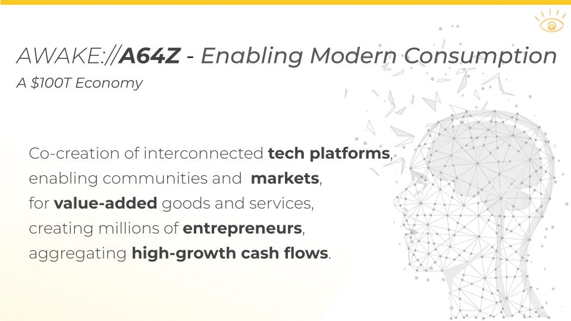

# a64z

Or how to engineer [dragons](Dragoneering%20b7a2d54ee5b24bcc9e4b8bc3d3397cfa.md) with Awake Protocols, and how [Private Equity](PE%2001681de8e6c14a6fb228ea68c7162414.md) embraces [humanity](Spirituality%2092a219db1398424ab4c4f02bfa9d93d2.md). 🚀

### Why AWAKE://A64Z

The PE and VC industries need to move up the value-addition scale. Awake is a **Berkshire Hathaway 2.0** type holding company that invests in high growth cash flow businesses in traditional industries that can be **digitally transformed** and scaled globally to produce outsize returns for investors. It does so using a unique combination of technology and strategy, the integrated operating system is affectionately named ***a64z***.

AWAKE://A64Z is a PE platform for AI+FinTech-Powered Global Value Co-creation.

### Value Added PE

A64Z enables a AI-powered FinTech-enabled globally scalable process of value-added capital allocation. By creating a seamlessly integrated functional market across the Internet, any investment firm can use a sound digital foundation for their businesses.

Awake does this using simple [HTTP](HTTP%20aa82b4ce356349bf81da2e73d2aa8482.md)-based Internet Protocols to bridge across Web2, Web3, metaverses, blockchains and so on. This simple [MetaWeb](MetaWeb%202e4dacd7566d45b78d97612a186082c0.md)-powered PaaS enables massively parallel value co-creation across the Internet. 

.jpg)

### **More:**

[A Modern Operating System for Internet Ventures](https://a64z.com)

---

[*AwakeVC*](https://awake.vc) **|** San Mateo, CA **|** *+1 415 800 4888* **|** [*info@awake.vc*](mailto:info@awake.vc)

*Because Protocols Are Eating Venture*